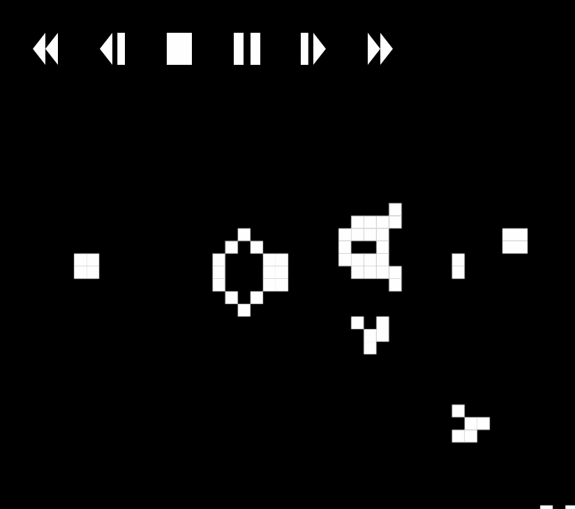

# Conway's Game of Life

The Game of Life is a game which plays itself created by the mathematician John
Conway. Given an initial set of cells, the game will play itself and let those
cells either live, die or resurrect.

This repository contains a JavaScript implementation of the Game of Life.
Feel free to play around!

## Controls

- Click and drag to paint.
- Scroll up and down to zoom.
- Click  or press `Space` to play.
- Click  or press `Space` to pause.
- Click  or press `Shift+Backspace` to reset.
- Click  or press `Right` to step forward.
- Click  or press `>` to increase speed.
- Click  or press `Left` to step backward.
- Click  or press `<` to decrease speed.
